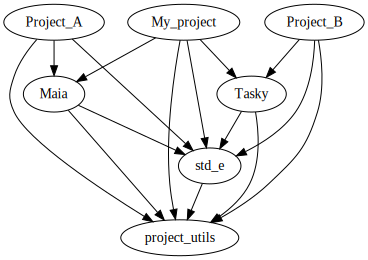

# Description #
We present here a way to organize git repositories for developping multiple projects sharing common libraries.
To give an more concrete idea of related libraries and projects, here is an example of dependencies between projects .
The projects we are talking about are *fine-grained*: a few peoples working on small libraries. We envision 2/3 people working on the same library at the same time, and 1 person working in several libraries at the same time.


# Requirements #
1. Versionning done by git. Git has become the de-facto standard and has gained a large consensus as being the right tool for the job.
2. Be able to easily create a library as we see fit, or extract a factored piece of code into a library. A well-written library has a well-defined role, a weak coupling with its dependencies, and no coupling at all to the other project that depend on it. Thus it is easier to learn, share, maintain and test.
3. Each library has its own git repository and can be built by itself. It simplifies testing. Furthermore, it also simplify learning it and ensures their is no hidden coupling with a "container" repository.
4. Possible to develop collabolatively on several project and library repositories at the same time.
5. Dependencies between repositories (both library and applications) should be *explicit, but lightweight*. It means that when working on several repositories, we do not want to manually create version numbers for each dependency repository, and then tell the dependent repository which version number it should use. It would be perfectly fine at a higher level of granularity, but here we are at a very fine level and versionning should be commit-based: "libA at commit 5f25414f works with libB at commit f16af47b", that's all: we do not ensure any further compatiblity.
6. Possibility to depend on libraries not integrated within this framework of interdependent git repositories. The main driving factor for using git-based dependency management comes from the fact that we want both separate libraries and develop them seamlessly when working on a dependent project. It may feels unpractical to use commit-based dependencies if the library is too big, or developped by another team, or developpers are not working on both at the same time. In this case it, version-based dependencies and release should be the way to go.

## Non-requirements ##
1. API stability.
  While it is certainly a good idea to ensure API stability and proper versioning for top-level projects, there is a tradeoff with flexibility. Here, we do not want to garantee API stability regarding small-scale libraries. Because then it would empede the ability to easily split projects into libraries, on behalf that a new library should ensure API stability.
2. Everybody uses master branches.
  While merging with master should be done as soon as possible, staying on the same commit of a dependency and not updating it while doing something else is perfectly acceptable.


# Proposed solution #

## Folder structure ##
```
libA/
|-- README.md
|-- LICENSE.md
|-- CMakeLists.txt # Top-level CMakeLists.txt for compiled project.
|                  # If non-compiled, an installation script should still be there.
|
|-- libA/          # Code of the library. No include/src separation (to useful). Contains unit tests.
|-- external/      # Library dependencies. They are submodules.
|   |-- libB/
|   |-- libC/
|
|-- doc/
|-- examples/
|
|-- scripts/       # Additional scripts (building, building tests, deployement machine-specific instructions...)
|-- tests/         # Functionnality/acceptance/performance/deployment tests
|-- build/         # NOT followd by git. Temporary files go there (.o files, ...)
```

## Versionning ##
Use of git.
## Build system ##
Use of Cmake (lack of a better alternative as of 2020). We at least mandate the use of "modern Cmake" i.e. with a somewhat clean definition of dependencies where each repository has its associated target(s) and they depend on other targets (not on paths and directories).

## Dependency management ##
There are three kinds of dependencies:
* Project-related dependencies
* Other-project dependencies (as per requirement 6.)
* System dependencies
The latter two are taken care of through Cmake and proper versionning. Regarding project-related dependencies, they must be managed at the commit level but we are not aware of git-based (or other version-control system) dependency managers. Our compromise is to use git submodules with a diciplined approach. In our , dependencies form a direct acyclic graph of depth 4. It is complicated:
1. It is 4 levels deep, which mean that dependencies (example: `project_1` depends on `app_lib_0`) have themselves dependencies (`app_lib_0` depends on `base_lib`)
2. It is NOT a tree (example `project_2` depends on `app_lib_0` and `app_lib_1`, and both depend on `base_lib`). Which raises two questions:
    1. What should we do if `app_lib_0` and `app_lib_1` depend on two different versions of `base_lib`?
    2. Should we include the content of `base_lib` twice? If yes, when changing it during the developpement of `project_2`, which one do we change?

The approach is the following:
1. Depending on two versions of the same library is forbidden/not supported.
2. Each repository `r` has all its project-related dependencies `d` taken into account as git submodules placed in `root_of_r/external/d`
3. Each repository `r` also has its indirect dependencies `i_d` stored in `root_of_r/external/i_d`
4. When working on repository `r`, *only its submodules are checked out*. The submodules of the submodules (indirect dependencies) are already checked out at the first level, and they are supposed to have the same version. Hence there is no need to have them twice.

+ The approach is relatively simple because there is only one submodule depth.
- The top-level repository must know of all its indirect dependencies. If we where to use a complex layering of many library, this could be a problem, but
    * In reality, the total number of repository involved is small. If it grows too much, then some project-related dependencies should be separated as other-project dependencies.
    * In our example, indirect dependencies are also direct dependencies, so it doesn't change anything. Our experience is that we are in this scenario most of the time.
+ At this fine-grained "white-box" level, it would not make sense to depend on two versions of the same library. If this is the case at some point, it happened because of a controlable update at one side. So either the discrepancy should be fixed, or the update should be reverted.
- The following scenario does not work out of the box:
    * working on `project_2`
    * we modify `base_lib`, its submodule, then commit it on `base_lib`
    * then update the `base_lib` commit on `project_2`
  We have violated the first rule because now `app_lib_0` points to the old commit of `base_lib`, but `project_2` points to the new one. In fact, the `app_lib_0` submodule working directory of `project_2` is built and uses the *new* sources of `base_lib`. The correction is not complicated in principle since we just need to tell `app_lib_0` the new commit of `base_lib` it should point to.


The worflow is based on git so every repository is a git repository.

## Definitions ##
A end-user package is repository which contains functionnalities that will be used by a end-user, not only by developper. It makes sense to install a end-user package for using it directly.
A building-block package is a repository that is primarily there to give some functionnality to a developper


In order to better explain the kind of problems we are dealing with, 
A project is a git repository 

# Context #

API stab
Size / maintainers

A way to 


## Pitfalls ##
1. Not taking into account changes to a submodule
TL;DR: 

Let's say you modify a file "file-1" in a git repository "top-level" and a file "file-2" on one of its submodules "sub-A". Then commiting on the repository "top-level" (with either `git add -A; git commit -m "message"` or `git commit -am "message"` will not take the submodule "file-2" into account, it will not commit with it "file-1" to "top-level", nor create a commit with "file-2" on "sub-A". You first need to commit "file-2" to "sub-A", then commit everything to "top-level", so that "top-level" does two thing: commit "file-1", and commit the new commit of "sub-A" to which its new commit will refer to.


## Open issues ##
With
B -> A
C -> A
C -> B
the project tree is
C/
|--C content
|--external/
   |--A/
   |  |--A content
   |--B/
      |--B content
      |--external
         /* EMPTY */
C/external/B/external is not populated because we already have C/external/A, so C/external/B/external/A would be redundant.
This is what we want. The problem is that when updating A and B accordingly, B should see that its dependency should also be updated. But this is not the case.
From the C perspective, it does not matter since everything is in sync from the top-level working tree perspective.
But if we are to build the updated B separatly, then it will refer to the un-updated A (because we never told the B git that A git has been updated), which is wrong


#git config --global status.submoduleSummary true
#git config --global diff.submodule log
#
#git config --global alias.sclone '__git_sclone() { git clone "$@" && git --git-dir=`pwd`/"$@" submodule update --init; }; __git_sclone'
#
#git config --global alias.fetchall '__git_fetchall() { git fetch --recurse-submodules=yes "$@"; }; __git_fetchall'
#
#git config --global alias.spull '__git_spull() { git pull "$@" && git submodule update --init; }; __git_spull'
#
#git config --global alias.spush '__git_spush() { git push --recurse-submodules=on-demand "$@"; }; __git_spush'

